# PDF to Ontology API

FastAPI app that converts PDF field documentation into OWL/RDF ontologies using an LLM. **By default it uses your local LM Studio server** (OpenAI-compatible API at `http://localhost:1234/v1`).

## Architecture Overview

The project has two main flows:

1. **PDF to OWL** – One-shot extraction: upload a PDF, get an OWL/RDF ontology file.
2. **Living ontology pipeline** – Build a knowledge graph from documents, then query it via RAG-style Q&A.

```mermaid
flowchart TB
    subgraph pdfFlow [PDF to OWL Flow]
        PDF[PDF Upload] --> ExtractPDF[extract_text_from_pdf]
        ExtractPDF --> LLMExtract[extract_ontology_schema]
        LLMExtract --> BuildOWL[build_ontology]
        BuildOWL --> Serialize[serialize_ontology]
    end

    subgraph livingFlow [Living Ontology Flow]
        Doc[Document] --> Load[load_document]
        Load --> Chunk[chunk_text]
        Chunk --> Extract[extract_ontology]
        Extract --> Merge[update_graph]
        Merge --> Infer[infer_relations]
        Infer --> Reason[run_inference]
        Reason --> Store[graph_store]
        Store --> QA[graph_index + answer_question]
    end
```



### Living Pipeline Data Flow

```
Document (PDF/DOCX/TXT/MD)
    → load_document()      # Extract text
    → chunk_text()         # Overlapping chunks (1200 chars, 200 overlap)
    → extract_ontology()   # LLM extracts entities & relations per chunk
    → update_graph()       # Merge into graph, canonicalize entity names
    → infer_relations()    # LLM infers extra relations (optional)
    → run_inference()      # Transitive/symmetric closure (axiom-based)
    → graph_store         # In-memory storage
    → graph_index         # Embedding index for RAG retrieval
    → answer_question()   # Q&A over ontology
```

## Setup

1. Install dependencies:
   ```bash
   pip install -r requirements.txt
   ```
   Or with dev tools: `pip install -e ".[dev]"`

2. **LM Studio (default)**  
   - Start [LM Studio](https://lmstudio.ai/) and load a model.  
   - Start the local server (e.g. port **1234**).  
   - No API key needed; the app defaults to `OPENAI_BASE_URL=http://localhost:1234/v1`.

3. **Optional:** use OpenAI cloud instead:
   ```bash
   export OPENAI_BASE_URL=https://api.openai.com/v1
   export OPENAI_API_KEY=sk-your-key
   ```

4. Run the application:
   ```bash
   uvicorn app.main:app --reload
   ```
   Or: `make run` (see [Development](#development))

## Docker

Run the app in a container with Docker Compose:

```bash
# Build and start
make docker-up
# or
docker compose up -d
```

- **LM Studio on host**: The default `OPENAI_BASE_URL` uses `host.docker.internal` to reach LM Studio on your machine. Ensure LM Studio is running and the server is started (port 1234).
- **OpenAI cloud**: Set `OPENAI_BASE_URL` and `OPENAI_API_KEY` in `.env` or as environment variables.

Create `.env` from `.env.example` to override defaults (optional; compose uses `host.docker.internal` for LM Studio by default). The image runs as a non-root user and uses a multi-stage build for security.

| Make target      | Description              |
|------------------|--------------------------|
| `make docker-build` | Build the Docker image |
| `make docker-up`    | Start with docker compose |
| `make docker-down`  | Stop docker compose      |

## Environment Variables

| Variable | Default | Description |
|----------|---------|-------------|
| `LOG_LEVEL` | `DEBUG` | Logging verbosity: DEBUG, INFO, WARNING, ERROR. Use DEBUG to trace every process step. |
| `OPENAI_BASE_URL` | `http://localhost:1234/v1` | LLM API base URL (LM Studio). Set to `https://api.openai.com/v1` for OpenAI. |
| `OPENAI_API_KEY` | (empty) | Required for OpenAI; can be empty for LM Studio. |
| `ONTOLOGY_LLM_MODEL` | `gpt-4o-mini` | Model name (use the name shown in LM Studio for local models). |
| `UPLOAD_MAX_SIZE_MB` | `20` | Max PDF upload size (MB). |
| `LLM_TIMEOUT_SECONDS` | `120` | Timeout for LLM requests. |

Copy `.env.example` to `.env` and adjust as needed.

## API Reference

| Method | Path | Description |
|--------|------|-------------|
| GET | `/` | Service info (name, docs URL, health URL) |
| GET | `/health` | Health check |
| POST | `/api/v1/ontology/from-pdf` | PDF → OWL/Turtle/JSON-LD ontology |
| POST | `/api/v1/build_ontology` | Document → living graph (chunk, extract, canonicalize, optional inference) |
| GET | `/api/v1/graph` | Current stored graph (node-link JSON) |
| POST | `/api/v1/reasoning/apply` | Re-run transitive/symmetric closure on stored graph |
| POST | `/api/v1/qa/ask` | RAG Q&A over ontology |

### POST /api/v1/ontology/from-pdf

- **Body:** `multipart/form-data` with field `file` (PDF).
- **Query:**
  - `output_format`: `owl` (default), `turtle`, or `json-ld`.
  - `response_type`: `file` (download) or `json`.

Example (download OWL file):

```bash
curl -X POST "http://localhost:8000/api/v1/ontology/from-pdf?output_format=owl" \
  -F "file=@your_documentation.pdf" \
  -o ontology.owl
```

Example (JSON response with ontology content):

```bash
curl -X POST "http://localhost:8000/api/v1/ontology/from-pdf?output_format=turtle&response_type=json" \
  -F "file=@your_documentation.pdf"
```

### POST /api/v1/build_ontology

- **Body:** `multipart/form-data` with field `file` (PDF, DOCX, TXT, or MD).
- **Query:** `run_inference` (default `true`) – run LLM relation inference after extraction.
- **Response:** Node-link JSON of the ontology graph (entities and relations).

```bash
curl -X POST "http://localhost:8000/api/v1/build_ontology" \
  -F "file=@examples/sample.txt"
```

### GET /api/v1/graph

Returns the current stored graph as node-link JSON. Returns 404 if no graph has been built.

### POST /api/v1/reasoning/apply

Re-runs axiom-based reasoning (transitive/symmetric closure) on the stored graph. Returns `{"edges_added": N, "graph": {...}}`.

### POST /api/v1/qa/ask

- **Body:** `{"question": "..."}`.
- **Query:** `retrieval_mode`: `snippets` (default, dual retrieval) or `hyperedges`.
- **Response:** `{"answer": "...", "sources": [...]}`. Build an ontology first.

```bash
curl -X POST "http://localhost:8000/api/v1/qa/ask" \
  -H "Content-Type: application/json" \
  -d '{"question": "What entities and relations are in this ontology?"}'
```

## Living Ontology Pipeline (ADR-001)

A second mode builds a **living knowledge graph** from documents (PDF, TXT, DOCX, MD): chunking, entity/relation extraction, canonicalization (embeddings), and optional relation inference. Same LM Studio config applies.

Additional dependencies: `networkx`, `sentence-transformers`, `matplotlib`, `pdfminer.six`, `python-docx`, `requests` (see `requirements.txt`).

## Development

### Makefile

Run `make help` for available targets:

| Target | Description |
|--------|-------------|
| `make install` | Install package with dev dependencies (editable) |
| `make run` | Run the FastAPI app with uvicorn (reload) |
| `make test` | Run pytest |
| `make lint` | Run ruff check |
| `make format` | Run ruff format |
| `make clean` | Remove `__pycache__`, `.pytest_cache`, `.ruff_cache` |

### Running Tests

```bash
make test
# or
pytest tests/ -v
```

### Install Dev Dependencies

```bash
make install
# or
pip install -e ".[dev]"
```

## Project Structure

```
app/                          # PDF → OWL flow
├── main.py                   # FastAPI app entry point
├── config.py                 # Pydantic settings (LLM URL, model, timeouts)
├── schemas.py                # Pydantic models: OntologySchema, ClassDef, etc.
├── pdf.py                    # PDF text extraction (pypdf)
├── llm_extract.py            # LLM schema extraction (OpenAI/LM Studio)
├── ontology.py               # rdflib Graph build + OWL/Turtle/JSON-LD serialize
└── routers/
    └── ontology.py           # POST /api/v1/ontology/from-pdf

ontology_builder/             # Living ontology pipeline
├── pipeline/                 # Document processing pipeline
│   ├── loader.py             # Load PDF, DOCX, TXT, MD
│   ├── chunker.py            # Overlapping text chunks
│   ├── extractor.py          # LLM entity/relation extraction
│   ├── ontology_builder.py   # Merge extractions, canonicalize
│   ├── relation_inferer.py   # LLM relation inference
│   └── run_pipeline.py       # Orchestration
├── ontology/                 # Ontology utilities
│   ├── schema.py             # Entity, Relation, OntologyExtraction models
│   ├── canonicalizer.py      # Embedding-based entity deduplication
│   └── rules.py              # Relation types for inference
├── llm/                      # LLM client
│   ├── lmstudio_client.py   # HTTP client for LM Studio/OpenAI
│   └── prompts.py            # Extraction and inference prompts
├── storage/                  # Graph storage
│   ├── graphdb.py            # OntologyGraph (NetworkX wrapper)
│   └── graph_store.py       # In-memory store for current graph
├── reasoning/                # Axiom-based reasoning
│   ├── engine.py             # Transitive/symmetric closure
│   └── rules.py              # Relation definitions
├── qa/                       # RAG Q&A
│   ├── graph_index.py        # Embedding index for retrieval
│   ├── answer.py             # LLM answer generation
│   └── prompts.py            # QA prompts
└── ui/                       # API and visualization
    ├── api.py                # build_ontology, graph, reasoning, qa endpoints
    └── graph_viewer.py       # Matplotlib graph visualization

documents/raw/                # Temporary uploads (build_ontology)
examples/                     # Sample documents for testing
tests/                        # Test suite
```

## Troubleshooting

| Issue | Solution |
|-------|----------|
| LM Studio not running | Start LM Studio, load a model, and start the local server (e.g. port 1234). |
| Empty PDF or "No text could be extracted" | PDF may be scanned/image-based; use OCR or a different PDF. |
| QA index empty / 503 on `/qa/ask` | Build an ontology first via `POST /api/v1/build_ontology`. |
| Model not found | Use the exact model name shown in LM Studio for `ONTOLOGY_LLM_MODEL`. |
| LLM timeout | Increase `LLM_TIMEOUT_SECONDS` for large documents. |
| `OPENAI_API_KEY` required | When using OpenAI cloud, set `OPENAI_BASE_URL` and `OPENAI_API_KEY`. |

## Contributing

### Adding New Relation Types

Edit `ontology_builder/reasoning/rules.py`:

- Add to `TRANSITIVE_RELATIONS` for relations like `part_of` (if A part_of B and B part_of C then A part_of C).
- Add to `SYMMETRIC_RELATIONS` for relations like `related_to` (if A related_to B then B related_to A).
- Add domain-specific rules in `DOMAIN_RULES` mapping subject keywords to relation sets.

### Extending Prompts

- `ontology_builder/llm/prompts.py` – `ONTOLOGY_EXTRACTION_PROMPT`, `INFERENCE_PROMPT` for extraction and inference.
- `ontology_builder/qa/prompts.py` – `QA_SYSTEM`, `QA_USER_TEMPLATE` for Q&A.

### Adding Formats

- For PDF-to-OWL: add format handling in `app/ontology.py` (`serialize_ontology`).
- For living pipeline: add suffix handling in `ontology_builder/pipeline/loader.py` and `ontology_builder/ui/api.py` (`_ALLOWED_SUFFIXES`).
