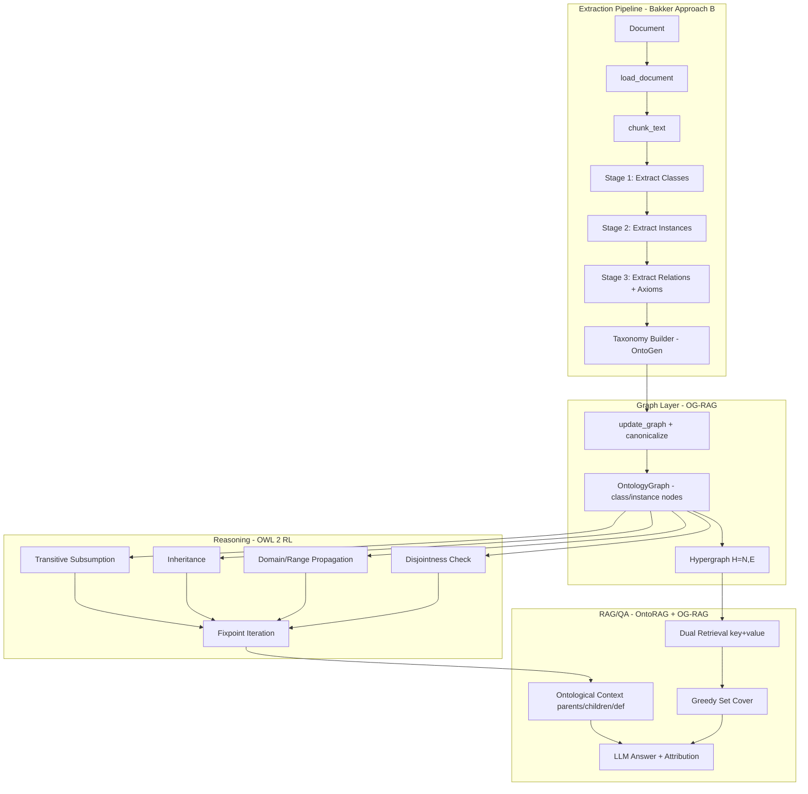

# Theory-Grounded Ontology Graph MVP

FastAPI application that builds **formal, theory-grounded ontologies** from documents using LLM extraction, OWL 2 RL reasoning, and ontology-grounded RAG. By default it uses your local **LM Studio** server (OpenAI-compatible API at `http://localhost:1234/v1`).

## Theoretical Foundation

This system integrates concepts from 7 academic papers:


| Paper                                               | Contribution                                                    | Codebase Layer         |
| --------------------------------------------------- | --------------------------------------------------------------- | ---------------------- |
| **Guarino et al.** — "What Is an Ontology?"         | Formal ontology definition O = {C, R, I, P}, meaning postulates | Schema, Reasoning      |
| **OG-RAG** (Sharma et al.)                          | Hypergraph construction, dual retrieval, greedy set cover       | Graph, RAG             |
| **Bakker et al.** — "Ontology Learning from Text"   | Sequential extraction (Approach B), P/R/F1 evaluation           | Extraction, Evaluation |
| **Smith & Proietti** — "OWL 2 RL Logic Programming" | Transitive subsumption, inheritance, domain/range rules         | Reasoning              |
| **OntoRAG** (ICLR)                                  | OntoGen taxonomy pipeline, ontological context enrichment       | Extraction, RAG        |
| **Gajderowicz et al.** — "RAG and Ontologies"       | RAG+KG integration patterns, embedding strategies               | RAG                    |
| **Huettemann et al.** — "Ontology-based Search"     | Information foraging theory, semantic enrichment                | UI/UX                  |


## Architecture




## Setup

1. Install dependencies:
   ```bash
   pip install -r requirements.txt
   ```
2. **LM Studio (default)**
  - Start [LM Studio](https://lmstudio.ai/) and load a model.
  - Start the local server (port **1234**).
  - No API key needed; defaults to `OPENAI_BASE_URL=http://localhost:1234/v1`.
3. **Optional:** use OpenAI cloud instead:
   ```bash
   cp .env.example .env
   # Edit .env with your OpenAI credentials
   ```
4. Run:
   ```bash
   uvicorn app.main:app --reload
   ```
   Or: `make run`

## Docker

```bash
make docker-up
# or
docker compose up -d
```

LM Studio on host is accessed via `host.docker.internal`. For OpenAI cloud, set vars in `.env`.

## Environment Variables


| Variable                 | Default                    | Description                 |
| ------------------------ | -------------------------- | --------------------------- |
| `LOG_LEVEL`              | `INFO`                     | Logging verbosity           |
| `OPENAI_BASE_URL`        | `http://localhost:1234/v1` | LLM API base URL            |
| `OPENAI_API_KEY`         | (empty)                    | Required for OpenAI cloud   |
| `ONTOLOGY_LLM_MODEL`     | `phi-3-mini-4k-instruct`   | Model name                  |
| `UPLOAD_MAX_SIZE_MB`     | `20`                       | Max upload size (MB)        |
| `LLM_TIMEOUT_SECONDS`    | `120`                      | LLM request timeout         |
| `LLM_MAX_RETRIES`        | `3`                        | LLM retry count             |
| `LLM_PARALLEL_WORKERS`   | auto (2 local, 30 ChatGPT) | Parallel workers; max throughput for gpt-4o-mini |
| `LLM_MAX_CHUNK_CHARS`   | `600`                      | Max chars per chunk (0=no truncation)  |
| `LLM_MAX_PROMPT_TOKENS` | `3000`                     | Soft token budget for prompts        |
| `LLM_FORCE_TEXT_MODE`   | `true`                     | Force text output when no explicit `response_format` is provided |

The extractor uses `response_format: {"type":"json_schema", ...}` for legacy `{entities, relations}` output. Prompt JSON examples are guidance only and not the schema payload sent to the API.
If a model does not support structured outputs (common for smaller models), the pipeline falls back to one text-mode retry and parses JSON from content.


## API Reference


| Method | Path                                           | Description                                             |
| ------ | ---------------------------------------------- | ------------------------------------------------------- |
| GET    | `/`                                            | Service info                                            |
| GET    | `/app`                                         | Chat UI (knowledge base selector, document upload, Q&A) |
| GET    | `/health`                                      | Health check                                            |
| POST   | `/api/v1/ontology/from-pdf`                    | PDF -> OWL/Turtle/JSON-LD                               |
| POST   | `/api/v1/build_ontology`                       | Document -> theory-grounded ontology graph              |
| POST   | `/api/v1/build_ontology_stream`                | Same as build_ontology, streams progress via SSE        |
| POST   | `/api/v1/knowledge-bases/{id}/extend_stream`   | Extend KB with new document (streaming)                 |
| POST   | `/api/v1/cancel_job/{job_id}`                   | Cancel an active pipeline job                           |
| GET    | `/api/v1/knowledge-bases`                      | List persisted knowledge bases                          |
| POST   | `/api/v1/knowledge-bases/{id}/activate`        | Load and activate a knowledge base                      |
| DELETE | `/api/v1/knowledge-bases/{id}`                 | Delete a persisted knowledge base                       |
| GET    | `/api/v1/graph`                                | Current graph (node-link JSON + stats)                  |
| GET    | `/api/v1/graph/image`                          | Graph as PNG image                                      |
| GET    | `/api/v1/graph/viewer`                         | Interactive vis.js graph viewer                         |
| POST   | `/api/v1/reasoning/apply`                      | Re-run OWL 2 RL reasoning with trace                    |
| POST   | `/api/v1/qa/ask`                               | Ontology-grounded RAG Q&A with attribution              |


### POST /api/v1/build_ontology

Runs the full theory-grounded pipeline: sequential extraction, taxonomy building, graph merge, OWL 2 RL reasoning.

- **Body:** `multipart/form-data` with `file` (PDF, DOCX, TXT, MD)
- **Query params:**
  - `run_inference` (bool, default `true`) — LLM relation inference
  - `sequential` (bool, default `true`) — 3-stage Bakker Approach B extraction
  - `run_reasoning` (bool, default `true`) — OWL 2 RL fixpoint reasoning
  - `parallel` (bool, default `true`) — Process chunks in parallel; if false, sequential
- **Response:** `BuildOntologyResponse` with graph export + full `PipelineReport`

```bash
curl -X POST "http://localhost:8000/api/v1/build_ontology" \
  -F "file=@document.pdf"
```

### POST /api/v1/qa/ask

Ontology-grounded RAG with fact-level attribution.

- **Body:** `{"question": "..."}`
- **Query:** `retrieval_mode`: `context` (OntoRAG enriched, default), `hyperedges` (OG-RAG), or `snippets`
- **Response:** `QASourceResponse` with answer, sources, source_refs, ontological_context

```bash
curl -X POST "http://localhost:8000/api/v1/qa/ask" \
  -H "Content-Type: application/json" \
  -d '{"question": "What are the main concepts?"}'
```

### POST /api/v1/reasoning/apply

Re-runs OWL 2 RL reasoning with full inference trace.

- **Response:** `ReasoningResponse` with inferred_edges, iterations, consistency_violations, inference_trace

### GET /api/v1/graph/viewer

Interactive graph visualization in the browser using vis.js. Classes shown as blue boxes, instances as green circles, edges colored by relation type.

## Project Structure

```
app/                          # PDF -> OWL flow
├── main.py                   # FastAPI entry point + CORS
├── config.py                 # Pydantic settings (cached)
├── schemas.py                # OWL serialization models
├── pdf.py                    # PDF text extraction
├── llm_extract.py            # LLM schema extraction
├── ontology.py               # rdflib Graph + OWL/Turtle/JSON-LD
└── routers/ontology.py       # POST /api/v1/ontology/from-pdf

ontology_builder/             # Theory-grounded pipeline
├── pipeline/
│   ├── loader.py             # Document loading (PDF/DOCX/TXT/MD)
│   ├── chunker.py            # Overlapping text chunks
│   ├── extractor.py          # Sequential extraction (Bakker B)
│   ├── taxonomy_builder.py   # OntoGen-style taxonomy organization
│   ├── ontology_builder.py   # Graph merge + canonicalization
│   ├── relation_inferer.py   # LLM relation inference
│   └── run_pipeline.py       # Pipeline orchestration + PipelineReport
├── ontology/
│   ├── schema.py             # Formal O={C,R,I,P} schema (Guarino)
│   ├── canonicalizer.py      # Embedding-based deduplication
│   └── rules.py              # OWL 2 RL rule declarations
├── llm/
│   ├── client.py             # Unified LLM client with retries
│   ├── lmstudio_client.py    # LM Studio wrapper
│   ├── json_repair.py         # JSON repair for LLM output
│   └── prompts.py            # 3-stage extraction + taxonomy prompts
├── storage/
│   ├── graphdb.py            # OntologyGraph (class/instance nodes, axioms)
│   ├── hypergraph.py         # OG-RAG hypergraph H=(N,E)
│   └── graph_store.py        # In-memory graph store
├── reasoning/
│   ├── engine.py             # OWL 2 RL rules + fixpoint + trace
│   └── rules.py              # Rule types + InferenceStep
├── qa/
│   ├── graph_index.py        # OntoRAG + OG-RAG retrieval
│   ├── answer.py             # LLM answer + attribution
│   └── prompts.py            # QA prompts with citation instructions
├── evaluation/
│   └── metrics.py            # P/R/F1, RAGAS metrics, PipelineReport
└── ui/
    ├── api.py                # All endpoints + response models
    ├── chat_ui.py            # Chat UI HTML (knowledge base selector, Q&A)
    └── graph_viewer.py       # Matplotlib PNG + vis.js HTML

tests/                        # Test suite
documents/raw/                # Temporary uploads
documents/ontology_graphs/    # Persisted knowledge bases
```

## Development

```bash
make install    # Install with dev dependencies
make test       # Run pytest
make lint       # Run ruff check
make format     # Run ruff format
make run        # Run with uvicorn --reload
```

## Troubleshooting


| Issue                 | Solution                                                         |
| --------------------- | ---------------------------------------------------------------- |
| LM Studio not running | Start LM Studio, load a model, start the server (port 1234)      |
| Empty PDF             | PDF may be scanned/image-based; use OCR or a text-based PDF      |
| 503 on `/api/v1/qa/ask` | Build an ontology first via `POST /api/v1/build_ontology`        |
| Model not found       | Use the exact model name from LM Studio for `ONTOLOGY_LLM_MODEL` |
| LLM timeout           | Increase `LLM_TIMEOUT_SECONDS`                                   |
| Structured output error (`Invalid JSON Schema` / unsupported) | Use a model with structured-output support (typically >=7B); fallback will retry in text mode once |


